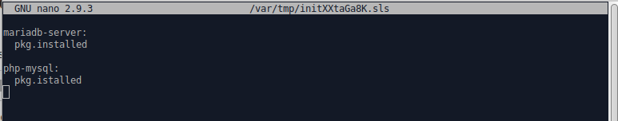

# Palvelinten hallinta - viikon 3 kotitehtävät

Tein tehtävät omalla ASUSin pöytätietokoneellani.   
Minulla oli käytössä VirtualBoxille asennettu Xubuntu 18.04.5 LTS Käyttöjärjestelmä.   
Tehtävien ratkaisemisen pohjana oli Tero Karvisen Palvelinten hallinta -kurssin kolmas opetuskerta 15.4.2021

## d) Näytä omalla git-varastollasi esimerkit komennoista ‘git log’, ‘git diff’ ja ‘git blame’. Selitä tulokset.

Git log komennolla saadaan esiin loki, jossa nähdään tehdyt muutokset ja kuka ne on tehnyt ja milloin.

Git diff komennolla voidaan verrata kahta eri versiota samasta tiedostosta. Esimerkistä näkee, että tiedoston nimeä on muutettu. Miinus merkit kuvaavat poistoa ja plus merkit lisäystä. Punaisella ja vihreällä värillä näytetään eroavaisuuksia. Vihreä väri kuvaa nykyistä versiota.

Git blame komennolla nähdään tiedoston jokainen rivi, rivin sisältö ja rivin tekijä ja aika, jolloin se on tehty.

Tehtävän kesto: 30min

## e) Tee tyhmä muutos gittiin, älä tee commit:tia. Tuhoa huonot muutokset ‘git reset –hard’. Huomaa, että tässä toiminnossa ei ole peruutusnappia.

Tein tyhmän muutoksen aikaisemmin tekemääni markdown harjoittelu tiedostoon. Tämän jälkeen tein git add . komennon ja sen jälkeen git reset --hard komennon. Tämä poisti tekemäni muutoksen md tiedostoon ja myös ottamani kuvakaappauksen.

Tehtävän kesto: 15min

## f) Tee uusi salt-moduli. Voit asentaa ja konfiguroida minkä vain uuden ohjelman: demonin, työpöytäohjelman tai komentokehotteesta toimivan ohjelman. Käytä tarvittaessa ‘find -printf “%T+ %p\n”|sort’ löytääksesi uudet asetustiedostot. (Tietysti eri ohjelma kuin aiemmissa tehtävissä, tarkoitushan on harjoitella Salttia)

Olin aikaisemmin asentanut apachen ja PHPn, joten päädyin asentamaan niiden jatkoksi MariaDBn. Aloitin asentamalla käsin.

	sudo apt install mariadb-server -y
	sudo apt install php-mysql -y

Testaamisen jälkeen poistin asetukset ja asensin uudelleen Saltilla. Aloitin tekemällä uuden kansion mariadb:lle ja tein kansioon init tiedoston.

	sudo mkdir /srv/salt/maria-db

Kirjoitusvirhe aiheutti punaista, korjasin sen ja asennus onnistui.

 

Päätin vielä lopuksi siirtää apachen, PHP:n ja MariaDb:n samaan tiedostoon. Tein lamp nimisen kansion, jonka init tiedostoon kopioin kaikkien kolmen init tiedostojen sisällön. Kopioin myös apache ja PHP kansioiden default-index.html ja ../mods-available/php7.2.conf tiedostot Lamp kansioon.

	sudo mkdir /srv/salt/lamp
	sudo cp default-index.html /srv/salt/lamp/
	sudo cd php7.2.conf /srv/salt/lamp
	sudoedit /srv/salt/lamp/init.sls

Poistin koneelta vanhat asennukset, jonka jälkeen testasin onnistuneesti.

	sudo apt purge apache2 mariadb-server mysql-php

Tehtävän kesto: 80min
